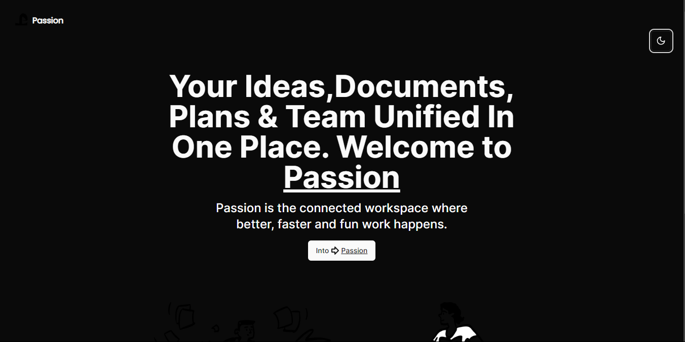
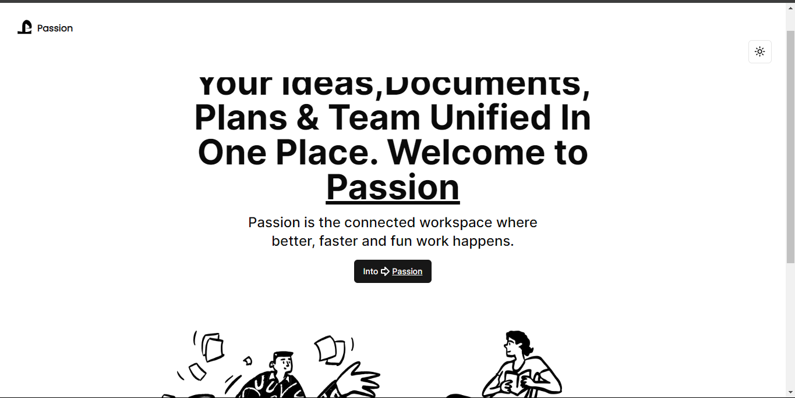

# Passion

Passion is a Next.js project that serves as a unified platform for organizing your ideas, documents, plans, and team collaboration. It is built using the Next.js framework and bootstrapped with `create-next-app`.

## Getting Started

To get started with Passion, follow these steps:

1. Clone the repository: `git clone https://github.com/Nde-Dilan/passion.git`
2. Install the dependencies: `npm install`
3. Run the development server: `npm run dev`

Open [http://localhost:3000](http://localhost:3000) in your browser to see the application.

## Features

- Editable pages: Modify the content of the pages by editing the corresponding files.
- Automatic page updates: The page will automatically update as you make changes to the files.
- Font optimization: Passion uses [`next/font`](https://nextjs.org/docs/basic-features/font-optimization) to optimize and load the Inter font, a custom Google Font.

## Project Structure
This project is structured as follows:

* app/: Contains the main application code.
* components/: Contains reusable components like ModeToggle and ThemeProvider.
* hooks/: Contains custom React hooks like useScrollTop.
* lib/: Contains utility functions.

## Learn More

To learn more about Next.js, check out the following resources:

- [Next.js Documentation](https://nextjs.org/docs): Learn about Next.js features and API.
- [Learn Next.js](https://nextjs.org/learn): An interactive Next.js tutorial.

## Screenshots

## Deploy on Vercel

The easiest way to deploy your Passion app is to use the [Vercel Platform](https://vercel.com/new?utm_medium=default-template&filter=next.js&utm_source=create-next-app&utm_campaign=create-next-app-readme) from the creators of Next.js.

For more details on deploying Next.js apps, refer to the [Next.js deployment documentation](https://nextjs.org/docs/deployment).

## Contributing

Contributions to Passion are welcome! If you have any ideas, suggestions, or bug reports, please open an issue or submit a pull request on the [GitHub repository](https://github.com/Nde-Dilan/passion).

## License

This project is licensed under the [MIT License](https://fr.wikipedia.org/wiki/Licence_MIT).
